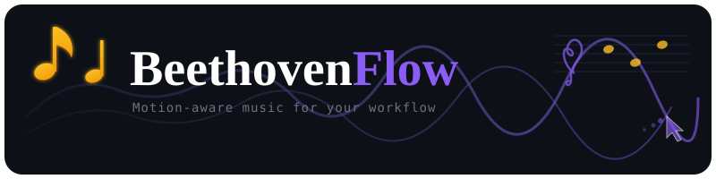

# 🎵 BeethovenFlow

<p align="center">
  
</p>

<p align="center">
  <a href="https://www.python.org/"></a>
  <a href="LICENSE"></a>
  
  
</p>

<p align="center">
  <strong>A motion-aware Beethoven music player that adapts to your interaction patterns.</strong><br/>
  No AI. No cloud. No tracking what you type. Just simple statistics from your mouse movement.
</p>

---

## How It Works

```
Your Mouse Movement → State Classification → Beethoven Music
      ↓                       ↓                    ↓
  Velocity + Jitter    2×2 Decision Grid      YouTube via MPV
```

BeethovenFlow measures two metrics:

| Metric | Description |
|--------|-------------|
| **Velocity** | How fast your mouse moves (px/sec) |
| **Jitter** | How erratic your movements are (directional changes) |

These map to four states:

|                    | Jitter LOW | Jitter HIGH |
|--------------------|------------|-------------|
| **Velocity LOW**   | 😴 Fatigued (calm adagios) | 🎯 Focused (piano sonatas) |
| **Velocity HIGH**  | ⚡ Energetic (symphonies) | 😰 Stressed (dramatic pieces) |

---

## Features

- **Privacy-First** — Only tracks mouse movement deltas. No keystrokes, no screenshots, no data leaves your machine.
- **Personalized Calibration** — 2-minute calibration learns your baseline activity patterns.
- **Time-Aware** — Adjusts thresholds based on time of day (calmer music at night).
- **Zero Playlists** — Dynamically searches YouTube for Beethoven, avoiding recently played tracks.
- **Cross-Platform IPC** — Communicates with MPV via Unix sockets (macOS) or Named Pipes (Windows).
- **Anti-Duplication** — Normalizes track titles to avoid hearing the same piece twice in a row.

---

## Requirements

- Python 3.8+
- [MPV](https://mpv.io/) media player
- [yt-dlp](https://github.com/yt-dlp/yt-dlp)
- Internet connection (for YouTube)

---

## Installation

### macOS

```bash
git clone https://github.com/yourusername/beethovenflow.git
cd beethovenflow
./install.sh
```

> **Note**: After first run, grant Accessibility permissions:  
> **System Settings → Privacy & Security → Accessibility** → enable your terminal app.

### Windows

```powershell
git clone https://github.com/yourusername/beethovenflow.git
cd beethovenflow
.\install.ps1
```

### Manual

```bash
# Install dependencies
brew install mpv yt-dlp   # macOS
winget install mpv yt-dlp # Windows

# Install BeethovenFlow
pip install -e .
```

---

## Usage

```bash
beethovenflow
```

### First Run

1. MPV starts in headless mode
2. Generic Beethoven plays based on time of day
3. Calibration runs for 2 minutes while you work normally
4. Mood-based music selection begins

### Controls

| Key | Action |
|-----|--------|
| `s` | Skip to next track |
| `p` | Pause/Resume |
| `r` | Recalibrate (2 min) |
| `i` | Show current state |
| `q` | Quit |

### Example Session

```
🎵 BeethovenFlow v1.0.0
───────────────────────────────────
Starting MPV... ✓

Calibrating... Move your mouse normally for 2 minutes.
Playing: Beethoven Piano Sonata No. 14 "Moonlight"

Calibrating: [████████████████████████████░░] 93%

✓ Calibration complete
  V_low: 42.3 px/s | V_high: 138.7 px/s | J_threshold: 0.45

[18:34] State: FOCUSED
        Playing: Beethoven Piano Sonata No. 8 "Pathétique" - II. Adagio

[18:42] State: ENERGETIC
        Playing: Beethoven Symphony No. 7 - IV. Allegro con brio
```

---

## Configuration

Config location:
- **macOS**: `~/Library/Application Support/BeethovenFlow/config.json`
- **Windows**: `%LOCALAPPDATA%\BeethovenFlow\config.json`

```json
{
  "cooldown_seconds": 300,
  "sample_interval_seconds": 10,
  "calibration_duration_seconds": 120,
  "history_size": 20,
  "time_scaling": {
    "morning": 0.9,
    "afternoon": 1.0,
    "evening": 1.2,
    "night": 1.5
  }
}
```

### Time of Day Behavior

| Period | Hours | Behavior |
|--------|-------|----------|
| Morning | 05:00–11:59 | More sensitive to energetic states |
| Afternoon | 12:00–16:59 | Standard baseline |
| Evening | 17:00–21:59 | Higher threshold for high-energy music |
| Night | 22:00–04:59 | Heavily biased toward calm tracks |

---

## Architecture

```
src/beethovenflow/
├── __main__.py      # CLI entry point, main loop
├── config.py        # Configuration management
├── tracker.py       # Mouse movement tracking (pynput)
├── calibration.py   # Baseline calibration
├── classifier.py    # State classification (2×2 grid)
├── player.py        # YouTube search, deduplication
└── mpv_control.py   # MPV IPC (Unix socket / Windows pipe)
```

---

## Privacy

| ✅ Does | ❌ Does NOT |
|---------|-------------|
| Track mouse position *changes* | Log keystrokes or text content |
| Calculate velocity/jitter statistics | Send data to external servers |
| Store calibration data locally | Record or store mouse paths |
| Search YouTube for music | Take screenshots |

---

## Troubleshooting

<details>
<summary><strong>"Could not start MPV"</strong></summary>

Verify MPV is installed and in PATH:
```bash
mpv --version
```
</details>

<details>
<summary><strong>macOS: "No mouse events detected"</strong></summary>

Grant Accessibility permissions:
1. **System Settings → Privacy & Security → Accessibility**
2. Find your terminal app and toggle it ON
</details>

<details>
<summary><strong>Music doesn't change</strong></summary>

- Default cooldown is 5 minutes between state changes
- Press `i` to see current state and cooldown remaining
- Press `r` to recalibrate
</details>

---

## Contributing

Contributions welcome! Ideas for improvement:

- [ ] System tray UI option
- [ ] Spotify integration (Premium users)
- [ ] Custom composer/genre selection
- [ ] Volume normalization
- [ ] Idle detection to pause

---

## License

[MIT License](LICENSE)
